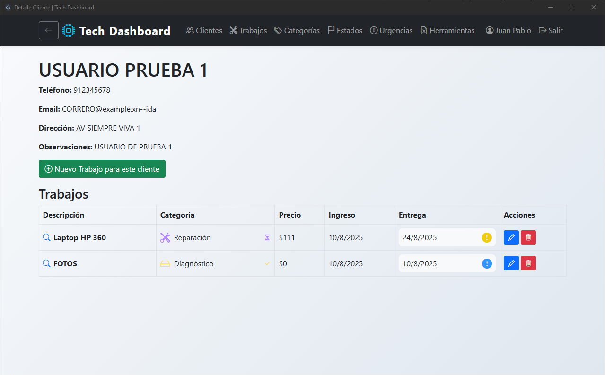

# Tech Dashboard Web

**Tech Dashboard Web** es una aplicación web profesional para la gestión de clientes, trabajos, archivos y métricas, diseñada para empresas de servicios técnicos, talleres y equipos de soporte.  
Funciona con **MongooseAtlas + Express** y permite integración con Google Drive para gestión de archivos y fotos.

---





---

## **Características principales**

- **Gestión de usuarios** con login seguro y perfiles.
- **Gestión de clientes**: crear, editar, eliminar, buscar y ver detalles.
- **Gestión de trabajos**: asociar trabajos a clientes, categorías, estados y urgencias.
- **Gestión de archivos/fotos**: integración con Google Drive, subida, renombrado, eliminación y descarga.
- **Exportación/Importación** de datos a CSV (ZIP) y Excel (dos hojas).
- **Vaciar base de datos** de clientes y trabajos por separado.
- **Interfaz moderna, responsiva y profesional** (Bootstrap 5).
- **Animaciones y alertas Bootstrap** en todas las acciones importantes.
- **Dashboard visual** con tarjetas de métricas, categorías y estados.

---

## **Requisitos**

- Node.js 18+ (recomendado)
- npm
- [Google Cloud Console](https://console.cloud.google.com/) (para Drive)
- [Mongoose](https://cloud.mongodb.com/) (Nesecita cuenta Atlas)

---

## **Instalación y uso**

1. **Clona el repositorio**
   ```bash
   git clone https://github.com/tuempresa/tech-dashboard-web.git
   cd tech-dashboard-web
   ```
Instala las dependencias

```Bash


Agrega tu archivo credentials.json de Google Drive
(descárgalo desde Google Cloud Console y colócalo en la raíz del proyecto).

Desarrollo

```Bash
npm run dev
```
Abre http://localhost:3000 en tu navegador.


El ejecutable estará en dist/win-unpacked/ (Windows).

## **Licencia**
```text

Copyright (c) 2024 DenguNorte

Este software es propiedad privada y está licenciado solo para uso interno y empresarial de Servicio Tecnico JP SPA o la organización que haya adquirido una licencia u permiso válido.

Queda prohibida la distribución, copia, modificación o uso fuera de la organización sin autorización expresa por escrito.

Para más información o licencias empresariales, contacta a: [christiancaceres1398@gmail.com]
```

## **Soporte**
Para soporte técnico, contacta a:
[christiancaceres1398@gmail.com]